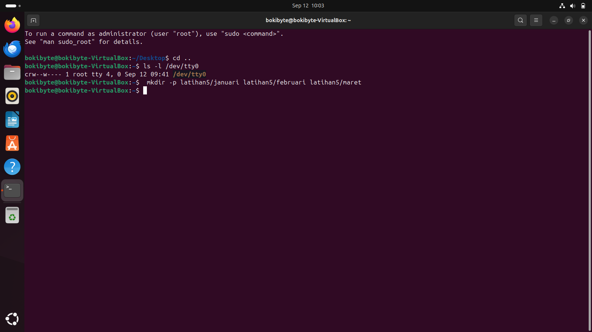
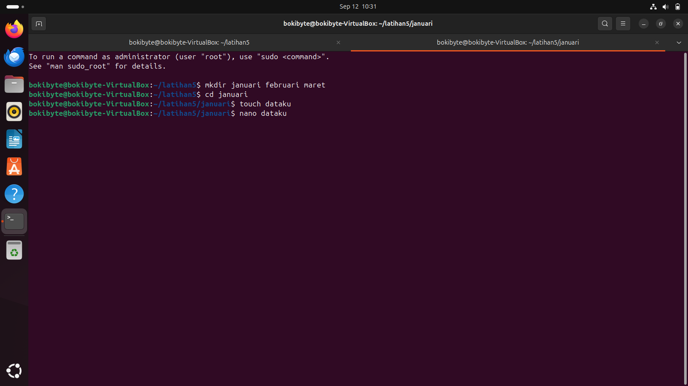
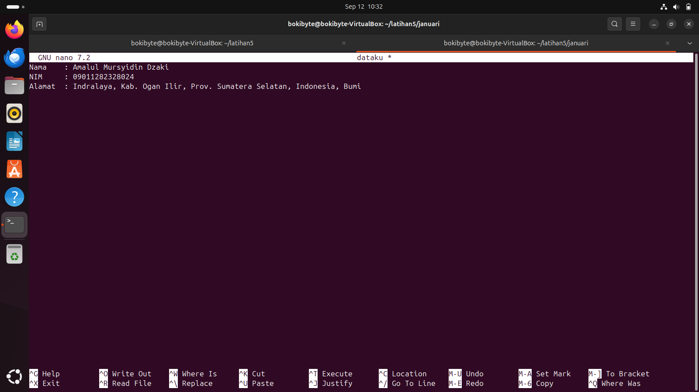
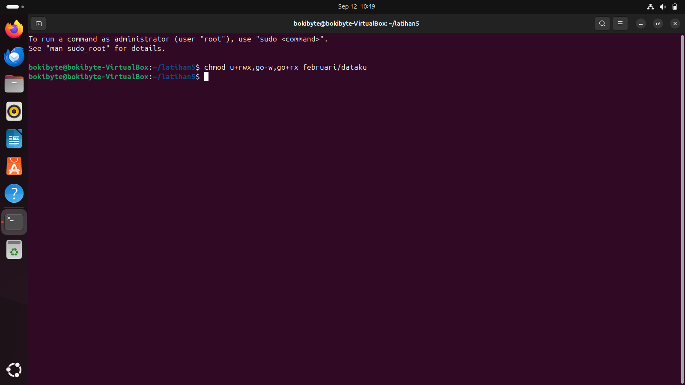
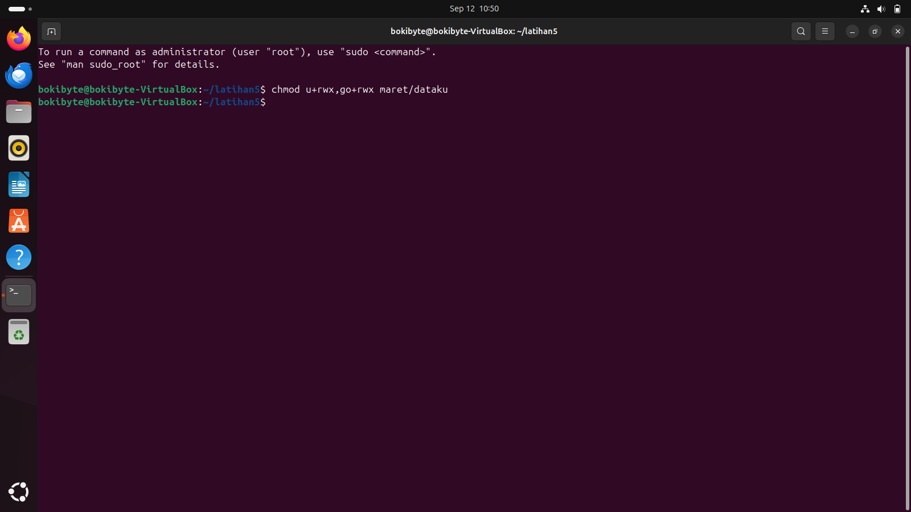
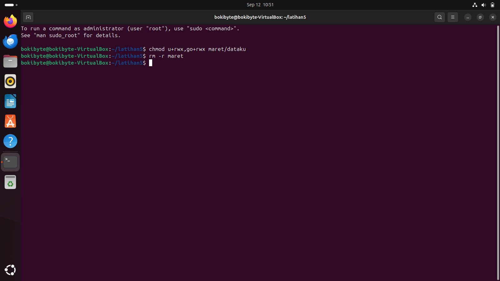
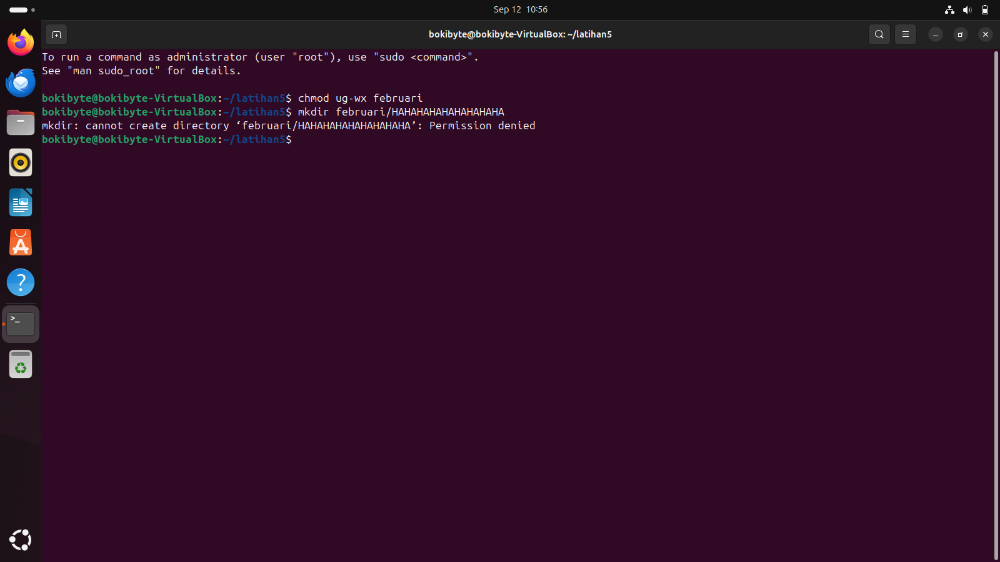
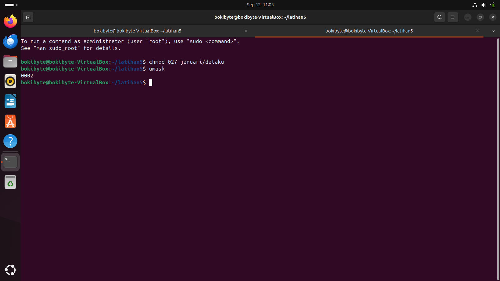
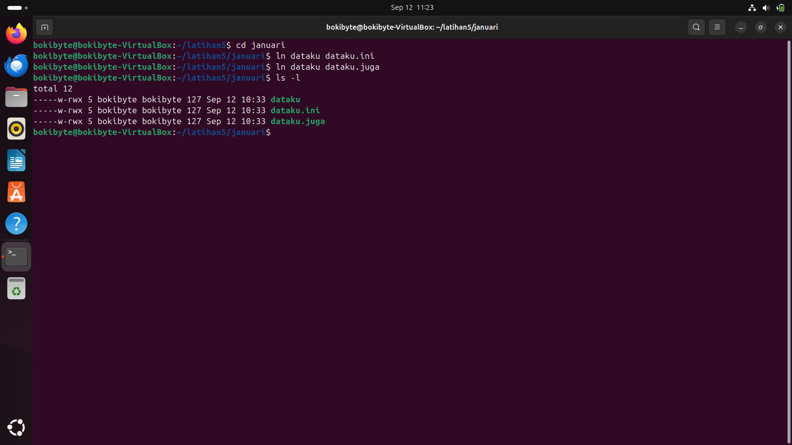

Amalul Mursyidin Dzaki  
09011282328024  
SK3C

# Tugas Praktikum 3

---

1. Lihat peralatan I/O, character device, yang ada pada system komputer.

   

2. Buatlah sub direktori **januari**, **februari** dan **maret** sekaligus pada direktori **latihan5**

   

3. Buatlah file dataku yang berisi **nama**, **nim** dan **alamat** anda pada sub direktori **januari** dan copy-kan file tersebut ke sub direktori **februari** dan **maret**.

   
   
   

4. Ubahlah ijin akses file dataku pada sub direktori januari sehingga **group** dan **others** dapat melakukan **write**.

   

5. Ubahlah ijin akses file dataku pada sub direktori februari sehingga user dapat melakukan baik **write**, **read** maupun **execute**, tetapi **group** dan others hanya bisa read dan execute.

   

6. Ubahlah ijin akses file dataku pada sub direktori maret sehingga semua dapat melakukan **write**, **read** dan **execute**.

   

7. Hapuslah direktori **maret**.

   

8. Ubahkan kepemilikan sub direktori **februari** sehingga **user** dan **group** hanya dapat melakukan read, dan cobalah untuk membuat direktori baru **haha** pada sub direktori **februari**.

   

9.  Modifikasi **umask** dari file dataku pada sub direktori **januari** menjadi **027** dan berapakan nilai default-nya ?

    

10. Buatlah **link** dari file dataku ke file **dataku.ini** dan file **dataku.juga** dan dengan perintah **list** perhatikan berapa **link** yang terjadi ?
 
    

